# 🏢 Windows Server 2022 & SQL Server Infrastructure Lab

> 💡 **About this Guide**
> An operational runbook documenting the deployment, low-level storage auditing, database engine provisioning, Role-Based Access Control (RBAC), and disaster recovery validation on Windows Server 2022 using VMware Workstation.
>
> Built and validated through hands-on implementation to reflect realistic system administration workflows.

---

## 📌 Architectural Specifications

| Component            | Specification                           | Engineering Purpose                                                                                    |
| :------------------- | :-------------------------------------- | :----------------------------------------------------------------------------------------------------- |
| **Hypervisor**       | VMware Workstation Pro                  | Isolated virtualization environment                                                                    |
| **Operating System** | Windows Server 2022 Standard Evaluation | Enterprise server platform                                                                             |
| **Compute Profile**  | 2 vCPUs / 6.5 GB RAM                    | Workload sizing for lab database operations                                                            |
| **Database Engine**  | Microsoft SQL Server (17.0 RTM)         | Relational database engine                                                                             |
| **Management Tool**  | SQL Server Management Studio (SSMS)     | Database engine administration and query interface                                                     |
| **Network Adapter**  | NAT                                     | Outbound connectivity for package retrieval while avoiding direct inbound exposure to the host network |
| **Filesystem**       | NTFS                                    | Structured and recoverable local volume management                                                     |

---

## 💾 Storage Topology & Workload Isolation

To optimize storage I/O and reduce resource contention, database file streams were decoupled across dedicated virtual disks:

| Volume | Mount / Path                   | Workload Profile                  | Configuration Details                                                             |
| :----- | :----------------------------- | :-------------------------------- | :-------------------------------------------------------------------------------- |
| **C:** | `C:\SQLData` & `C:\SQLBackups` | Random Reads/Writes & DR Archives | Host OS storage, primary database data pages (`.mdf`), and `.bak` archive sets    |
| **D:** | `D:\SQLLogs`                   | High-Frequency Sequential Writes  | Dedicated volume for transaction log streams (`.ldf`) to prevent write contention |
| **E:** | `E:\SQLTempDB`                 | Volatile Workspace                | Temporary runtime tables, row versioning, and internal sort operations            |

> 📌 **Engineering Note:**
> In enterprise data centers, database storage is often distributed across independent SAN/NAS tiers. In this lab setup, segregating transaction logs onto **`D:`** ensures high-throughput log writing does not compete with system OS operations and data page writes on **`C:`**.

---

## ⚙️ Phase 1: Virtual Infrastructure & OS Provisioning

### Step 1: Virtual Machine Hardware Configuration

* Configured dedicated virtual disks attached to the VM to support logical workload separation.
* Sized virtual memory to 6.5 GB with 2 vCPUs to ensure smooth database engine startup and query processing.

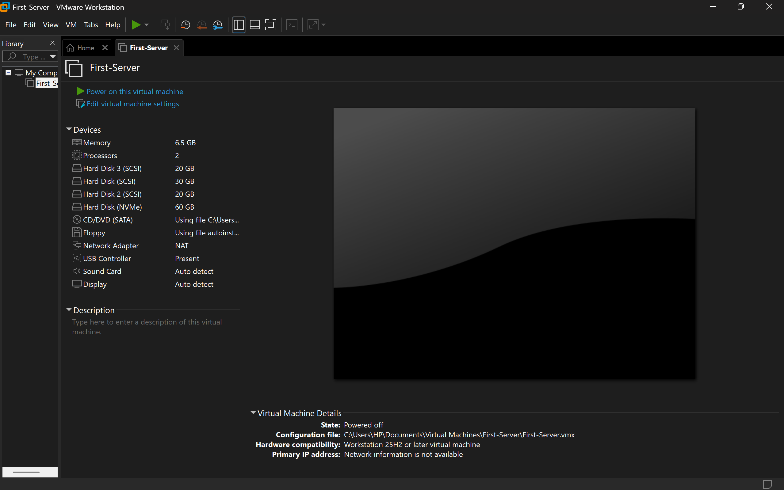

---

### Step 2: Windows Server Operating System Deployment

* Installed **Windows Server 2022 Standard Evaluation (Desktop Experience)** to enable local administration via Server Manager and SSMS.
* Completed baseline operating system configuration and secured the local `Administrator` credentials.

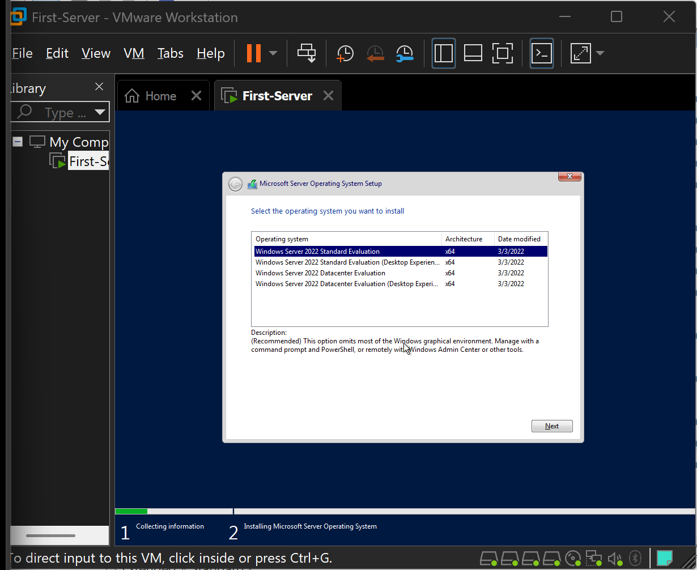

---

## 🛠️ Phase 2: Storage Auditing, Partitioning & Networking

### Step 3: Low-Level Storage Inspection (`diskpart`)

> 📌 **Engineering Note:**
> Inspecting storage from the Windows Recovery Environment (WinPE) using `diskpart` is an essential troubleshooting workflow, allowing administrators to verify drive letters, partition health, and directory accessibility outside the running OS.

Audited volume topology and verified drive assignments from the WinPE command environment:

```cmd
diskpart
list volume
```

Verified the dedicated log mount point:

```cmd
D:
dir
```

* Confirmed the existence and accessibility of `D:\SQLLogs`.

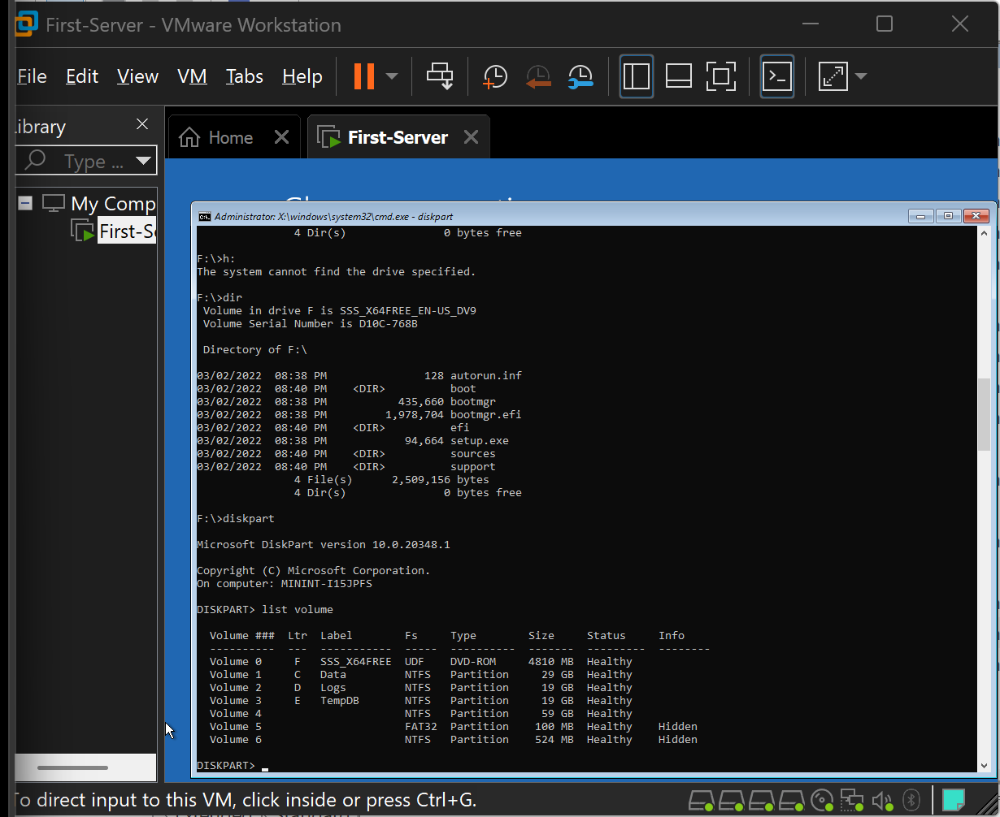

---

### Step 4: Administrator Logon & Environment Setup

* Logged into the server console using the local Administrator account to proceed with storage provisioning and role management.

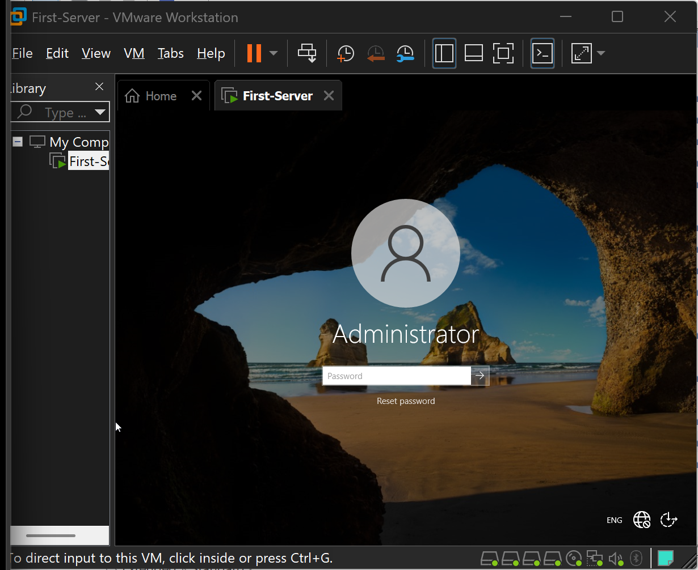

---

### Step 5: Enterprise Disk Initialization & Partitioning

* Unallocated disks were brought online, initialized, and formatted as NTFS volumes using the **Disk Management** console.
* Logical storage was mapped across the system:

  * `C:\SQLData` — Primary data storage
  * `D:\SQLLogs` — Transaction log storage
  * `C:\SQLBackups` — Backup storage directory
  * `E:` — TempDB workspace

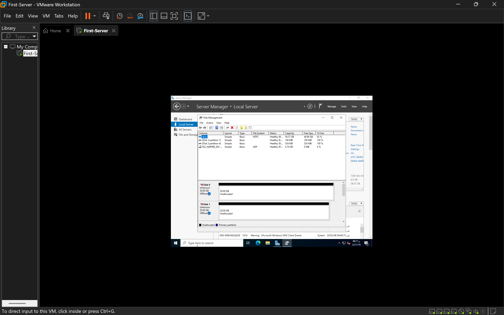

---

### Step 6: Virtual Network Configuration

* Configured the virtual network adapter to **NAT** mode to provide outbound internet access for tool downloads while avoiding direct inbound exposure from the external network.

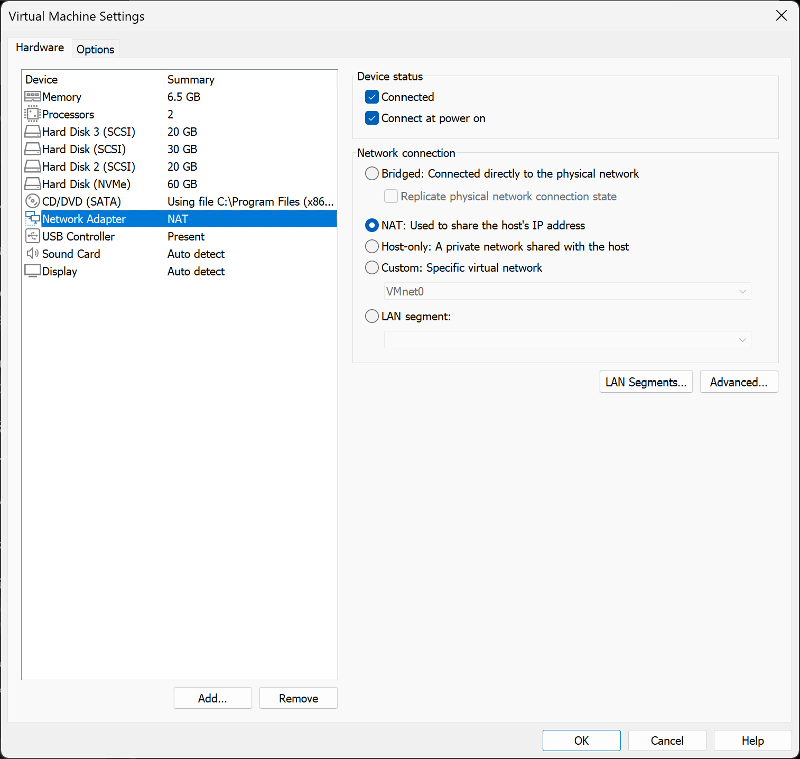

---

## 💾 Phase 3: SQL Server Engine Deployment

### Step 7: Custom Setup Launch

* Initiated the SQL Server setup media using **Custom** installation mode to control service accounts, directory paths, and authentication methods.

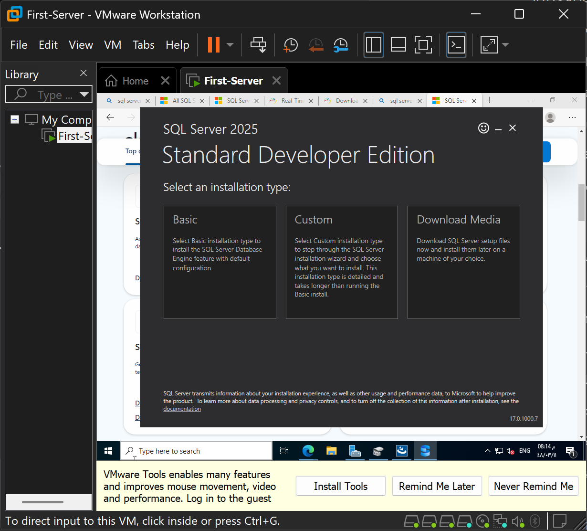

---

### Step 8: Feature Selection

> 📌 **Engineering Note:**
> Applied the principle of attack surface reduction by installing only the components required for the database engine workload:

* **Database Engine Services** — Core database engine
* **SQL Server Replication** — Instance synchronization
* **Integration Services** — ETL workflows

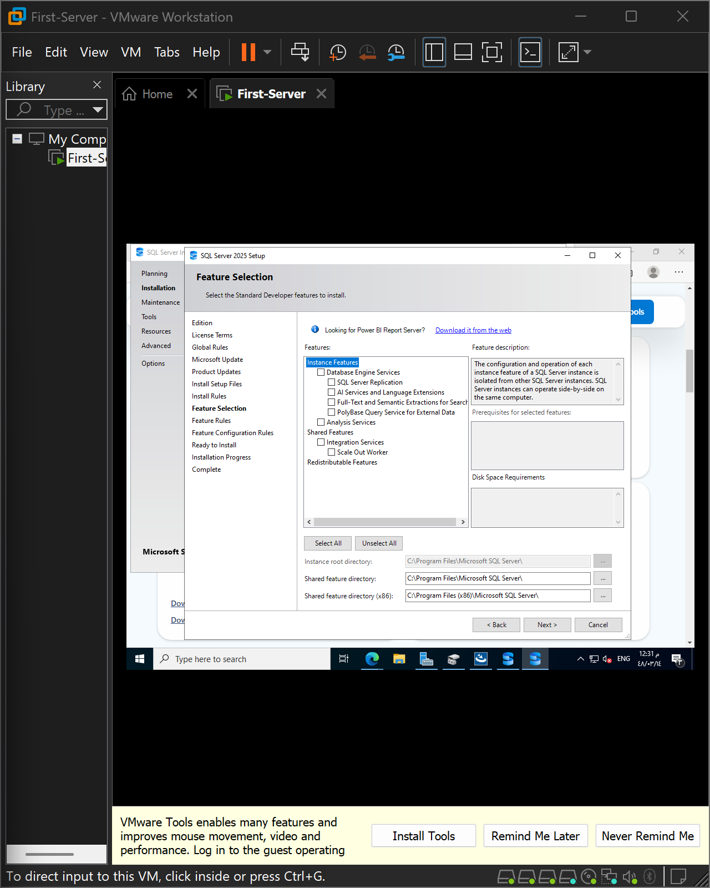

---

### Step 9: Virtual Service Account Assignment

* Bound database engine services to default virtual accounts (`NT Service\MSSQLSERVER`) to run operations under an isolated, least-privilege security model.

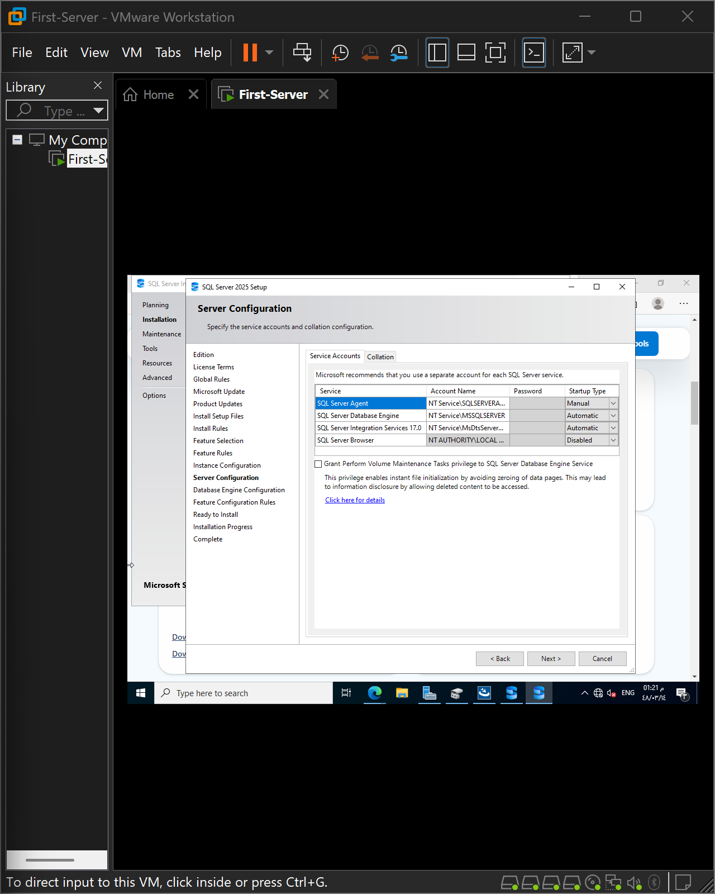

---

### Step 10: Authentication Configuration

* Selected **Windows Authentication Mode** to leverage operating system identity verification, adding the local Windows administrative user as an authorized SQL Server administrator.

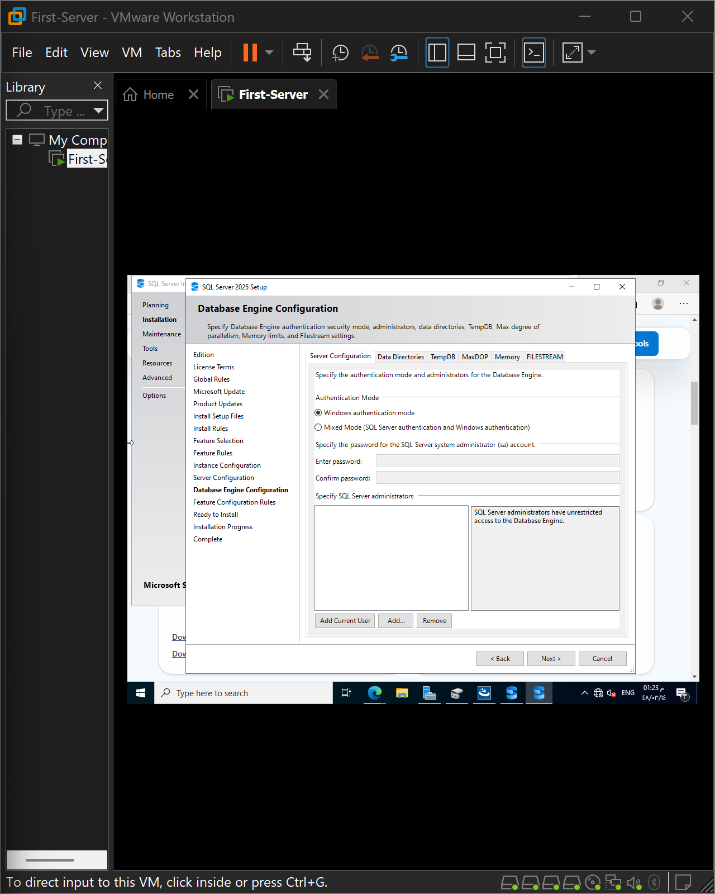

---

### Step 11: Enterprise Storage Path Separation

* Mapped default instance storage paths to the configured multi-disk structure:

```text
Data root:        C:\SQLData
User DB log:      D:\SQLLogs
Backup directory: C:\SQLBackups
```

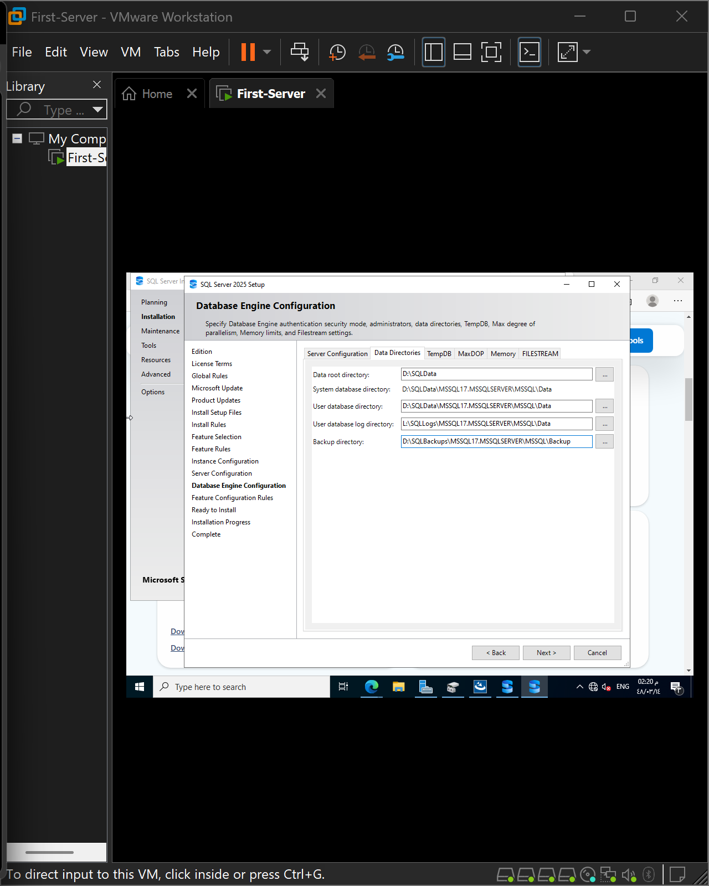

---

### Step 12: Deployment Verification

* Verified that the Database Engine, replication features, and background services completed setup with a `Succeeded` status.

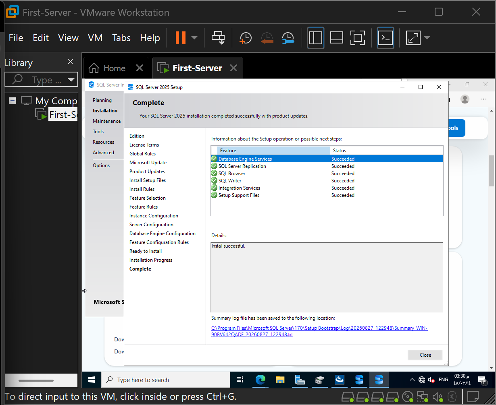

---

## 🛡️ Phase 4: Database Hardening, RBAC & Backup

### Step 13: SSMS Connection & Unified Script Execution

* Established a connection to the local database instance using SQL Server Management Studio (SSMS).
* Executed the consolidated administrative script. Individual modular scripts are also available in the [`sql/`](sql/) directory.

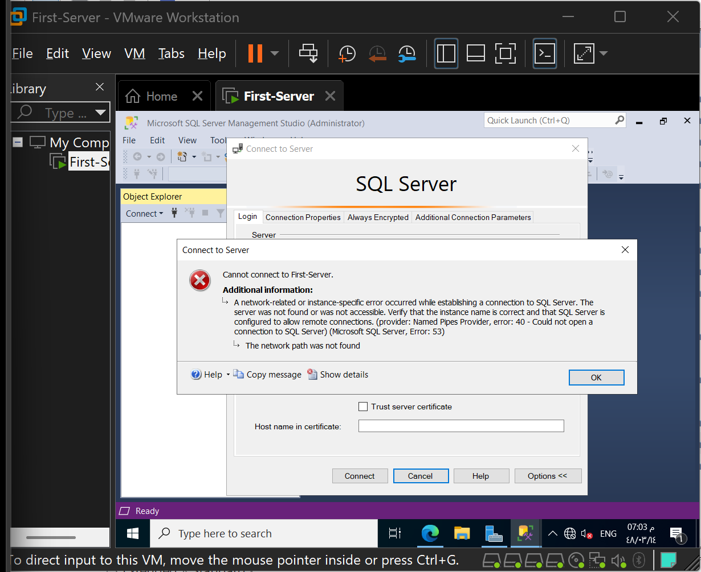

```sql
/* ==============================================================================
   Author:        Ruba Aljuhani
   Environment:   Windows Server 2022 / Microsoft SQL Server
   Description:   Consolidated Database Provisioning, RBAC, Auditing & Backup
   ============================================================================== */

-- [Step 1: Database Creation & Storage Separation]
CREATE DATABASE EnterpriseDB
ON PRIMARY
(
    NAME = 'EnterpriseDB_Data',
    FILENAME = 'C:\SQLData\EnterpriseDB_Data.mdf',
    SIZE = 100MB,
    MAXSIZE = 5GB,
    FILEGROWTH = 64MB
)
LOG ON
(
    NAME = 'EnterpriseDB_Log',
    FILENAME = 'D:\SQLLogs\EnterpriseDB_Log.ldf',
    SIZE = 50MB,
    MAXSIZE = 2GB,
    FILEGROWTH = 32MB
);
GO

-- [Step 2: RBAC & Least Privilege Security Hardening]
USE master;
GO

CREATE LOGIN AppReadOnlyUser
WITH PASSWORD = '<REPLACE_WITH_SECURE_PASSWORD>';
GO

USE EnterpriseDB;
GO

CREATE USER AppReadOnlyUser
FOR LOGIN AppReadOnlyUser;
GO

-- Bind strictly to read permissions; avoid granting sysadmin or db_owner
ALTER ROLE db_datareader
ADD MEMBER AppReadOnlyUser;
GO

-- [Step 3: Audit Schema & Verification Records]
USE EnterpriseDB;
GO

CREATE TABLE SystemAudit
(
    AuditID INT IDENTITY(1,1) PRIMARY KEY,
    EventName NVARCHAR(100),
    CreatedBy NVARCHAR(50) DEFAULT 'Ruba Aljuhani',
    EventDate DATETIME DEFAULT GETDATE()
);
GO

INSERT INTO SystemAudit (EventName)
VALUES
    ('Storage Separation Verified'),
    ('RBAC Policy Applied'),
    ('Disaster Recovery Baseline Created');
GO

-- [Step 4: Full Database Backup Execution]
BACKUP DATABASE EnterpriseDB
TO DISK = 'C:\SQLBackups\EnterpriseDB_Full.bak'
WITH FORMAT,
     MEDIANAME = 'SQLServerBackups',
     NAME = 'EnterpriseDB Full Database Backup';
GO
```

---

### Step 14: Execution & Backup Verification

* Verified that the entire script executed without errors:

  * The database was created with decoupled storage files.
  * Role-based access control was applied without elevated privileges.
  * The audit table recorded infrastructure baseline entries.
  * A full database backup was written and validated cleanly to `C:\SQLBackups\EnterpriseDB_Full.bak`.

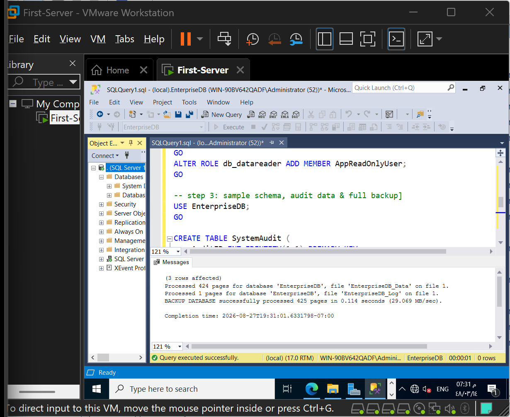

---

## 📁 Repository Structure

```text
windows-server-sql-lab/
│
├── README.md
│
├── Server/
│   ├── 1-vm-hardware.png
│   ├── 2-os-edition.png
│   ├── 3-diskpart.png
│   ├── 4-server-logon.png
│   ├── 5-disk-management.png
│   ├── 6-network-nat.png
│   ├── 7-sql-installer.png
│   ├── 8-feature-selection.png
│   ├── 9-service-accounts.png
│   ├── 10-authentication.png
│   ├── 11-storage-paths.png
│   ├── 12-installation-complete.png
│   ├── 13-ssms.png
│   └── 14-backup-verification.png
│
└── sql/
    ├── 1-create-database.sql
    ├── 2-rbac.sql
    ├── 3-audit.sql
    └── 4-backup.sql
```

---

**Ruba Aljuhani 👩🏻‍💻**

Computer Science
